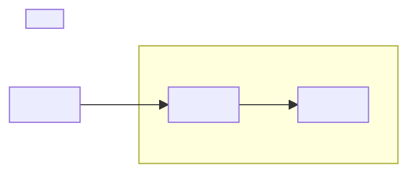

> Этот шаблон используется как паспорт на старте. Пока flow не реализован, статус документа должен оставаться `unimplemented`.
## 1. Назначение

Коротко:
- что делает flow;
- в каком слое живет;
- для чего он нужен в общей архитектуре.

## 2. Steps

> Если на canvas есть sticky-подложка, её название становится подзаголовком `### 2.N.`, а ноды под ней описываются внутри этого пункта.
> Если sticky-подложки нет, шаги нумеруются напрямую.
> Имена нод в паспорте **точно совпадают** с именами нод на canvas.

### 2.1. <Название sticky-подложки или шага>

#### Node: `<Node Name>`
`[<Node Type>]`

Что делает:
- ...

Что возвращает:
- ...

#### Node: `<Node Name>`
`[<Node Type>]`

Что делает:
- ...

Что возвращает:
- ...

### 2.2. <Следующая подложка или шаг>

#### Node: `<Node Name>`
`[<Node Type>]`

Что делает:
- ...

Что возвращает:
- ...

## 3. Contracts

### 3.1. Входной

```json
{
  "<field>": "<value>"
}
```

### 3.2. Выходной

```json
{
  "<field>": "<value>"
}
```

## 4. Skeleton



> Правила skeleton:
> - Один блок = одна n8n node.
> - `subgraph` = sticky-подложка на canvas; метка subgraph = имя подложки.
> - Sticky-подложка без исполняемых нод — пустой `subgraph`.
> - Порядок и связи блоков максимально точно повторяют canvas.
