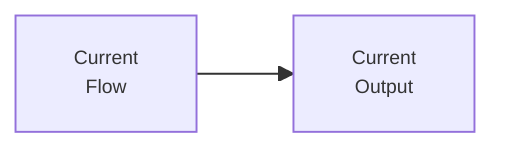
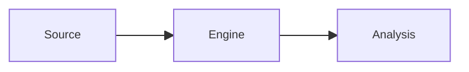

# <Project Name>

## Бизнес-ценность

<Что проект делает, для кого и зачем существует.>

<Как проект достигает результата: какие источники, фильтры, нормализация, анализ или storage участвуют в ценностной цепочке.>

## Карта проекта

### As Is

### To Be

## Flow-паспорта

| Layer | Type | Flow | Passport |
| ----- | ---- | ---- | -------- |
| Source | workflow | <Exact n8n flow name> | [`<flow-slug>`](./flow-docs/<flow-slug>.md) |

## Contracts

- `<Boundary>`: <короткий контракт между слоями или workflow>.

## Open Questions

1. <Вопрос, который влияет на следующий инженерный шаг.>

