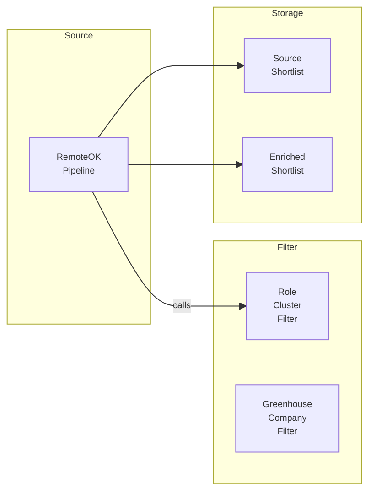
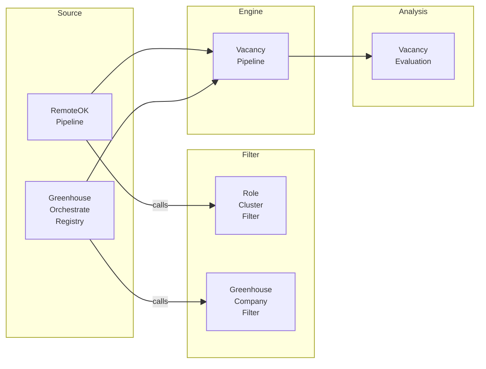

# Job Searcher

## Бизнес-ценность

`Job Searcher` превращает разрозненный поиск вакансий в управляемый pipeline: задаёт критерии поиска, забирает вакансии из источников, отбирает первичный shortlist и готовит основу для AI-оценки релевантности.

Ценность проекта — сократить ручной просмотр job boards и сделать поиск воспроизводимым. Уже восстановленный `RemoteOK Pipeline` показывает целевую механику: source-flow получает вакансии, подтягивает filter contract, вычисляет role/tech/remote сигналы, сохраняет shortlist в Google Sheets и отправляет подходящие записи на LLM enrichment.

## Карта проекта

### As Is

### To Be

## Flow-паспорта

| Layer  | Type     | Flow                                                        | Passport |
| ------ | -------- | ----------------------------------------------------------- | -------- |
| Filter | subflow  | Job Searcher / Filter / Role Cluster Filter                 | [`role-cluster-filter`](./flow-docs/role-cluster-filter.md) |
| Filter | subflow  | Job Searcher / Filter / Greenhouse Company Filter           | [`greenhouse-company-filter`](./flow-docs/greenhouse-company-filter.md) |
| Source | workflow | Job Searcher / 01 Sources / RemoteOK Pipeline               | [`remoteok-pipeline`](./flow-docs/remoteok-pipeline.md) |
| Source | workflow | Job Searcher / 01 Sources / Greenhouse Orchestrate Registry | [`greenhouse-orchestrate-registry`](./flow-docs/greenhouse-orchestrate-registry.md) |

## Contracts

- `Filter → Source`: filter-subflow возвращает критерии отбора, source-flow не хранит filter-логику внутри себя.
- `RemoteOK Source → Storage`: `RemoteOK Pipeline` пишет `shortlist_record` и `enriched_record` в Google Sheets.
- `Source → Engine`: source-flow отдаёт вакансии и source-level signals без финальной канонизации.
- `Engine → Analysis`: `Analysis` получает только engine-ready данные и не зависит напрямую от source-specific payload.

## Open Questions

1. Где будет храниться canonical vacancy model после восстановления `Engine`.
2. Какие источники кроме RemoteOK и Greenhouse входят в первую активную фазу.
3. Какой dashboard станет минимальным эталоном для проекта.
