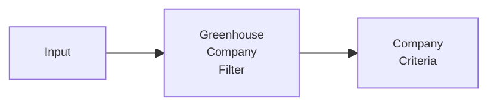

## 1. Назначение

Subflow готовит company/token критерии для Greenhouse-источников.

## 2. Steps

TBD после сверки с текущим canvas n8n.

## 3. Contracts

### 3.1. Входной

TBD.

### 3.2. Выходной

TBD: список Greenhouse company/token критериев для source-flow.

## 4. Skeleton

