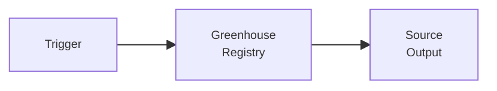

## 1. Назначение

Workflow обходит Greenhouse registry/company tokens и получает вакансии из Greenhouse-источников.

## 2. Steps

TBD после сверки с текущим canvas n8n.

## 3. Contracts

### 3.1. Входной

TBD: company/token критерии.

### 3.2. Выходной

TBD: source-level вакансии Greenhouse для будущего `Engine`.

## 4. Skeleton

