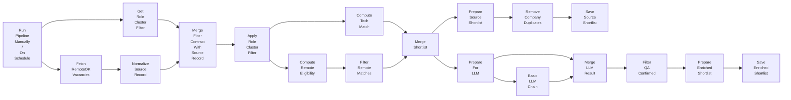

## 1. Назначение

Коротко:

- получает вакансии из `RemoteOK`;
- применяет первичную source-level фильтрацию по role-cluster, tech и remote;
- сохраняет промежуточный shortlist и отдельно прогоняет подходящие записи через LLM-обогащение.

## 2. Steps

### 2.1. Запустить source flow
#### Node: `Run Pipeline Manually`, `Run Pipeline On Schedule`
`[Manual Trigger, Schedule Trigger]`

Что делает:
- запускает flow вручную или по расписанию;
- одновременно запускает основную source-ветку и ветку загрузки filter contract.

Что возвращает:
- сигнал на запуск source-flow.

### 2.2. Загрузить role-cluster criteria
#### Node: `Get Role Cluster Filter`
`[Execute Workflow]`

Что делает:
- вызывает subflow `Job Searcher / Filter / Role Cluster Filter`;
- получает criteria contract для активных role-кластеров;
- идет отдельной параллельной веткой до точки merge.

Что возвращает:
- `filter_value.active_clusters`;
- `filter_value.cluster_definitions`;
- `filter_value.keywords`.

### 2.3. Забрать вакансии из RemoteOK
#### Node: `Fetch RemoteOK Vacancies`
`[HTTP Request]`

Что делает:
- запрашивает `https://remoteok.com/api`;
- получает общий список вакансий источника.

Что возвращает:
- raw payload вакансий `RemoteOK`.

### 2.4. Нормализовать базовые поля
#### Node: `Normalize Source Record`
`[Set]`

Что делает:
- оставляет базовые поля source-record;
- приводит запись к удобному виду для дальнейшей фильтрации.

Что возвращает:
- `id`;
- `company`;
- `position`;
- `tags`;
- `description`.

### 2.5. Свести filter contract и source-record
#### Node: `Merge Filter Contract With Source Record`
`[Merge]`

Что делает:
- объединяет параллельную ветку с role-cluster contract и основную source-ветку;
- использует `Merge` в режиме `Combine -> All Possible Combinations`, чтобы приложить один criteria-contract ко всем source-record;
- подает в code-node уже единый объект, где рядом лежат source data и filter data.

Что возвращает:
- source-record + `filter_value`.

### 2.6. Применить role-cluster criteria
#### Node: `Apply Role Cluster Filter`
`[Code Node]`

Что делает:
- берет criteria contract из merged input;
- сопоставляет `position`, `description`, `tags` с role-кластерами;
- отбрасывает записи без role-cluster match.

Что возвращает:
- только записи с role-cluster match;
- `role_cluster_match`;
- `role_cluster_filter`.

### 2.7. Отфильтровать tech и remote shortlist
#### Node: `Compute Tech Match`, `Compute Remote Eligibility`, `Filter Remote Matches`, `Merge Shortlist`
`[Code Node, Code Node, Filter, Merge]`

Что делает:
- `Compute Tech Match` вычисляет `tech_match`;
- `Compute Remote Eligibility` вычисляет `remote_for_foreigner`;
- `Filter Remote Matches` оставляет только remote-подходящие записи;
- `Merge Shortlist` собирает пересечение shortlist для дальнейшей обработки.

Что возвращает:
- shortlist записей после source-level heuristics;
- `tech_match`;
- `remote_for_foreigner`.

### 2.8. Сохранить shortlist компаний
#### Node: `Prepare Source Shortlist`, `Remove Company Duplicates`, `Save Source Shortlist`
`[Set, Remove Duplicates, Google Sheets]`

Что делает:
- подготавливает сокращенный shortlist;
- убирает дубликаты;
- пишет shortlist в Google Sheets.

Что возвращает:
- shortlist по компаниям и source-level signals в storage.

### 2.9. Подготовить кандидатов на LLM enrichment
#### Node: `Prepare For LLM`
`[Set]`

Что делает:
- готовит запись для LLM-анализа;
- оставляет поля, нужные для перевода и дополнительной QA-проверки.

Что возвращает:
- `id`;
- `company`;
- `position`;
- `description`.

### 2.10. Выполнить LLM enrichment и сохранить результат
#### Node: `Basic LLM Chain`, `Merge LLM Result`, `Filter QA Confirmed`, `Prepare Enriched Shortlist`, `Save Enriched Shortlist`
`[LLM Chain, Merge, Filter, Set, Google Sheets]`

Что делает:
- `Basic LLM Chain` переводит описание и возвращает structured output;
- `Merge LLM Result` склеивает source record и LLM result;
- `Filter QA Confirmed` оставляет только записи, где LLM подтвердил `qa`;
- `Prepare Enriched Shortlist` подготавливает итоговую запись;
- `Save Enriched Shortlist` пишет enrichment result в Google Sheets.

Что возвращает:
- enriched QA shortlist с `ru_description`.

## 3. Contracts

### 3.1. Входной

```json
{}
```

### 3.2. Выходной

```json
{
  "shortlist_record": {
    "company": "Example Company",
    "tech_match": true,
    "remote_for_foreigner": true
  },
  "enriched_record": {
    "id": "12345",
    "company": "Example Company",
    "position": "Senior QA Engineer",
    "description": "<original description>",
    "ru_description": "<translated description>"
  }
}
```

## 4. Skeleton



