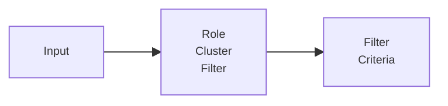

## 1. Назначение

Subflow формирует или применяет role/title критерии для отбора вакансий.

## 2. Steps

TBD после сверки с текущим canvas n8n.

## 3. Contracts

### 3.1. Входной

TBD.

### 3.2. Выходной

TBD: критерии role/title для source-flow.

## 4. Skeleton

