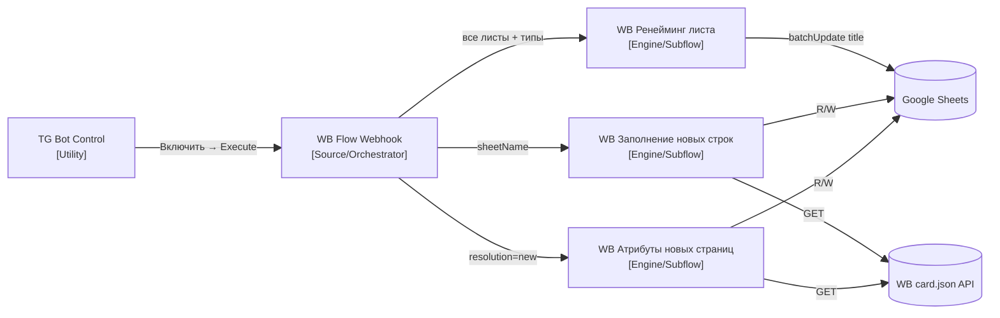

# Wildberries

Автоматизация ведения товарного справочника в Google Sheets на основе данных Wildberries. Система отслеживает новые листы (SKU-группы), разворачивает атрибутную структуру, заполняет строки нормализованными данными и переименовывает листы по категории. Управление — через Telegram-бот (одна кнопка `ВКЛЮЧИТЬ`).

**Состояние на 2026-05-02: все 5 флоу активны, система в рабочем состоянии.**

## Карта проекта

## Flow-паспорта

| Layer | Type | n8n Name | ID | Паспорт | JSON |
|-------|------|----------|----|---------|------|
| Utility | workflow | `Wildberries / Utility / TG Bot Control` | `OCOu4G3k5W7JchYE` | [tg-bot-control](./flow-docs/tg-bot-control.md) | [→](./flows/wildberries-utility-tg-bot-control.json) |
| Source | orchestrator | `Wildberries / Source / WB Flow Webhook` | `5v6bHbLoj1tNjrhT` | [wb-flow-webhook](./flow-docs/wb-flow-webhook.md) | [→](./flows/wildberries-source-wb-flow-webhook.json) |
| Engine | subflow | `WB Атрибуты новых страниц` | `K2b7NpHHLXbr9FDz` | [wb-atributy-novyh-stranic](./flow-docs/wb-attributes-new-pages.md) | [→](./flows/wb-atributy-novyh-stranic.json) |
| Engine | subflow | `WB Заполнение новых строк` | `88LhHNzfuXNgHTR8` | [wb-zapolnenie-novyh-strok](./flow-docs/wb-fill-new-rows.md) | [→](./flows/wb-zapolnenie-novyh-strok.json) |
| Engine | subflow | `WB Ренейминг листа` | `JgnGeSxjOeSLeZQT` | [wb-renejming-lista](./flow-docs/wb-rename-sheet.md) | [→](./flows/wb-renejming-lista.json) |

## Contracts

- **TG Bot Control → WB Flow Webhook**: вызов через `executeWorkflow`, входных данных нет.
- **WB Flow Webhook → WB Атрибуты новых страниц**: листы с `resolution=new`; сабфлоу пишет заголовки в A1.
- **WB Flow Webhook → WB Заполнение новых строк**: `sheetName`; сабфлоу читает весь лист, заполняет незаполненные строки батчем.
- **WB Flow Webhook → WB Ренейминг листа**: все листы со `sheetId`; фильтрует шаблонные и переименовывает через batchUpdate.
- **Google Sheets**: spreadsheet ID `1L3LBcyYm1pY0UTTenMr53kCruzaD0XNjkFPYqfPUbNg`; технический лист (ренейминг) — `gid=771469630`.
- **WB card.json**: URL = `https://basket-{basket}.wbbasket.ru/vol{vol}/part{part}/{nm}/info/ru/card.json`.

## Нейминг

Три Engine-сабфлоу созданы до конвенции `Wildberries / <Layer> / <Name>`. Переименование — в backlog; текущее состояние canonical.
