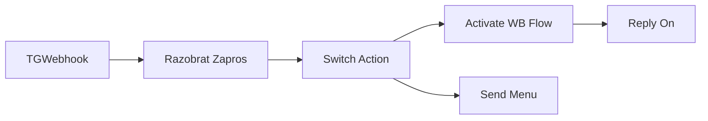

## 1. Назначение

`TG Bot Control` — utility workflow проекта Wildberries с одной кнопкой `ВКЛЮЧИТЬ`. Кнопка запускает flow-orchestrator `WB Flow Webhook` по webhook `wb-flow` и передаёт `chatId`, чтобы старт и completion-пинги приходили в тот же Telegram chat.

## 2. Steps

#### Node: `TGWebhook`
`n8n-nodes-base.telegramTrigger`

Принимает `message` и `callback_query` от Telegram-бота `WB Bot`.

#### Node: `Razobrat Zapros`
`n8n-nodes-base.code`

Нормализует вход:

- для `callback_query` берёт `chatId` из `callback_query.message.chat.id`;
- для обычного сообщения берёт `chatId` из `message.chat.id`;
- разрешает только callback `включить`;
- для сообщения включает показ меню.

#### Node: `Switch Action`
`n8n-nodes-base.switch`

Разделяет два сценария:

- `включить` → `Activate WB Flow`
- fallback → `Send Menu`

#### Node: `Activate WB Flow`
`n8n-nodes-base.httpRequest`

Вызывает orchestrator webhook:

`POST https://n8n-tech.samandrey.work/webhook/wb-flow`

В body передаёт `chatId`.

#### Node: `Send Menu`
`n8n-nodes-base.telegram`

Показывает одну inline-кнопку:

- `ВКЛЮЧИТЬ`

#### Node: `Reply On`
`n8n-nodes-base.telegram`

Отвечает в чат:

`✅ <b>Оркестратор запущен</b>`

## 3. Contracts

### 3.1. Input

Допустимы:

```json
{
  "message": {
    "chat": {
      "id": 272425172
    }
  }
}
```

и:

```json
{
  "callback_query": {
    "data": "включить",
    "message": {
      "chat": {
        "id": 272425172
      }
    }
  }
}
```

### 3.2. Behavior

- Любое сообщение показывает меню с одной кнопкой.
- Нажатие `ВКЛЮЧИТЬ` запускает `WB Flow Webhook`.
- После запуска бот пишет короткое подтверждение.

## 4. Validation Notes

- Workflow active.
- `n8n_validate_workflow` returns `valid: true`.
- Remaining warnings are non-blocking and mainly relate to code-node style checks and generic error-handling advice.

## 5. Skeleton


