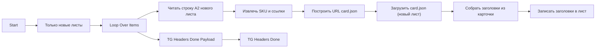

## 1. Назначение

`WB Атрибуты новых страниц` - subflow для новых листов. Он достраивает заголовки по данным карточки Wildberries и отправляет Telegram-пинг о завершении.

## 2. Steps

#### Node: `Start`
`n8n-nodes-base.executeWorkflowTrigger`

Принимает `sheetName` и `chatId` из source-flow.

#### Node: `Только новые листы`
`n8n-nodes-base.filter`

Пропускает только `resolution = new`.

#### Node: `Читать строку A2 нового листа`
`n8n-nodes-base.httpRequest`

Читает seed-строку листа.

#### Node: `Извлечь SKU и ссылки`
`n8n-nodes-base.code`

Формирует items для первой карточки из строки.

#### Node: `Построить URL card.json`
`n8n-nodes-base.code`

Собирает `cardJsonUrl` по SKU и basket.

#### Node: `Загрузить card.json (новый лист)`
`n8n-nodes-base.httpRequest`

Загружает публичный `card.json`.

#### Node: `Собрать заголовки из карточки`
`n8n-nodes-base.code`

Формирует итоговый список заголовков.

#### Node: `Записать заголовки в лист`
`n8n-nodes-base.httpRequest`

Обновляет первую строку нового листа.

#### Node: `TG Headers Done Payload`
`n8n-nodes-base.code`

Готовит Telegram payload с `chatId`.

#### Node: `TG Headers Done`
`n8n-nodes-base.telegram`

Отправляет сообщение:

`✅ <b>WB Flow</b>: заголовки новых страниц обновлены`

## 3. Contracts

### 3.1. Input

```json
{
  "sheetName": "Косметички",
  "chatId": "272425172"
}
```

### 3.2. Output

Subflow не возвращает пользовательский payload. Он обновляет Google Sheets и завершает run Telegram completion ping.

## 4. Skeleton


