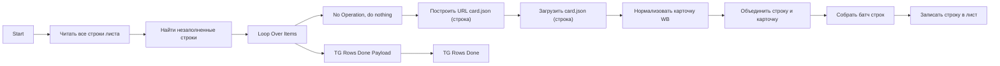

## 1. Назначение

`WB Заполнение новых строк` - subflow, который ищет пустые строки в существующих листах, подтягивает карточку Wildberries и заполняет лист данными. После завершения отправляет Telegram completion ping.

## 2. Steps

#### Node: `Start`
`n8n-nodes-base.executeWorkflowTrigger`

Принимает `sheetName` и `chatId`.

#### Node: `Читать все строки листа`
`n8n-nodes-base.httpRequest`

Читает весь лист для поиска пустых строк.

#### Node: `Найти незаполненные строки`
`n8n-nodes-base.code`

Выделяет строки, где первые колонки заполнены, а `Название` пустое.

#### Node: `Loop Over Items`
`n8n-nodes-base.splitInBatches`

Обрабатывает найденные строки батчами.

#### Node: `Построить URL card.json (строка)`
`n8n-nodes-base.code`

Строит адрес `card.json` для каждой строки.

#### Node: `Загрузить card.json (строка)`
`n8n-nodes-base.httpRequest`

Запрашивает карточку Wildberries.

#### Node: `Нормализовать карточку WB`
`n8n-nodes-base.code`

Восстанавливает контекст строки и формирует итоговый объект для записи.

#### Node: `Собрать батч строк`
`n8n-nodes-base.code`

Собирает `batchUpdate` payload.

#### Node: `Записать строку в лист`
`n8n-nodes-base.httpRequest`

Пишет батч строк в Google Sheets.

#### Node: `TG Rows Done Payload`
`n8n-nodes-base.code`

Готовит Telegram payload с `chatId`.

#### Node: `TG Rows Done`
`n8n-nodes-base.telegram`

Отправляет сообщение:

`✅ <b>WB Flow</b>: заполнение новых строк завершено`

## 3. Contracts

### 3.1. Input

```json
{
  "sheetName": "Косметички",
  "chatId": "272425172"
}
```

### 3.2. Output

Subflow пишет в Google Sheets и завершает выполнение Telegram completion ping.

## 4. Skeleton


