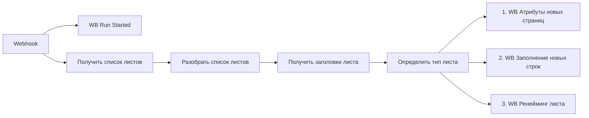

## 1. Назначение

`WB Flow Webhook` - source workflow проекта Wildberries. Он запускается один раз через webhook `wb-flow`, читает Google Sheets, определяет тип листа и распределяет обработку по трём active subflow. Старт и завершение этапов стримятся в Telegram в один chat через `chatId`, пришедший в webhook payload или через fallback `272425172`.

Старый Telegram control flow больше не является точкой входа.

## 2. Steps

### 2.1. Webhook launch

#### Node: `Webhook`
`n8n-nodes-base.webhook`

Принимает один запуск по path `wb-flow`. Формат payload допускает `chatId` в `body` или `query`.

### 2.2. Start ping

#### Node: `WB Run Started`
`n8n-nodes-base.telegram`

Сразу после старта отправляет сообщение:

`🚀 <b>WB Flow</b> запущен по webhook`

### 2.3. Sheet discovery

#### Node: `Получить список листов`
`n8n-nodes-base.httpRequest`

Читает метаданные Google Sheets и получает список tabs.

#### Node: `Разобрать список листов`
`n8n-nodes-base.code`

Нормализует список листов в items с `sheetName` и `sheetId`.

#### Node: `Получить заголовки листа`
`n8n-nodes-base.httpRequest`

Читает первые две строки каждого листа.

#### Node: `Определить тип листа`
`n8n-nodes-base.code`

Классифицирует лист как `new`, `template` или `old`.

### 2.4. Fan-out to subflows

#### Node: `1. WB Атрибуты новых страниц`
`n8n-nodes-base.executeWorkflow`

Запускает subflow для новых листов и передаёт `chatId`.

#### Node: `2. WB Заполнение новых строк`
`n8n-nodes-base.executeWorkflow`

Запускает subflow для заполнения строк и передаёт `sheetName` + `chatId`.

#### Node: `3. WB Ренейминг листа`
`n8n-nodes-base.executeWorkflow`

Запускает subflow для rename-ветки и передаёт `chatId`.

## 3. Contracts

### 3.1. Вход

Webhook payload может быть пустым. Допустимый payload:

```json
{
  "chatId": "272425172"
}
```

### 3.2. Telegram progress contract

- `WB Run Started` отправляет стартовый пинг.
- Каждый subflow получает `chatId` через Execute Workflow input.
- Каждый subflow завершает run своим Telegram-пингом из code payload + Telegram node.
- Telegram nodes используют `resource-locator` expression, привязанную к `$json.chatId`.

## 4. Validation Notes

- Workflow active.
- `n8n_validate_workflow` returns `valid: true`.
- Webhook path: `wb-flow`.
- Remaining warnings are non-blocking and mainly relate to code nodes and generic webhook response advice.

## 5. Related Subflows

- `WB Атрибуты новых страниц` - обновление заголовков новых листов и завершение через Telegram.
- `WB Заполнение новых строк` - наполнение пустых строк и Telegram completion ping.
- `WB Ренейминг листа` - rename технических листов и Telegram completion ping.

## 6. Skeleton


