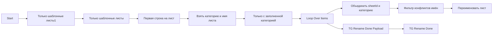

## 1. Назначение

`WB Ренейминг листа` - subflow, который переименовывает technical sheets по категории и завершает run Telegram completion ping.

## 2. Steps

#### Node: `Start`
`n8n-nodes-base.executeWorkflowTrigger`

Принимает `chatId`.

#### Node: `Только шаблонные листы1`
`n8n-nodes-base.filter`

Отбирает листы-кандидаты по имени.

#### Node: `Только шаблонные листы`
`n8n-nodes-base.filter`

Сужает набор до шаблонных листов.

#### Node: `Читать строки технического листа`
`n8n-nodes-base.googleSheets`

Читает строки на целевом technical sheet.

#### Node: `Первая строка на лист`
`n8n-nodes-base.code`

Берёт первую строку с заполненной `Категория 1`.

#### Node: `Взять категорию и имя листа`
`n8n-nodes-base.set`

Подготавливает `sheetName` к rename.

#### Node: `Объединить sheetId и категорию`
`n8n-nodes-base.merge`

Склеивает sheetId и категорию.

#### Node: `Фильтр конфликтов имён`
`n8n-nodes-base.code`

Убирает конфликты будущего имени.

#### Node: `Переименовать лист`
`n8n-nodes-base.httpRequest`

Вызывает Google Sheets batchUpdate rename.

#### Node: `TG Rename Done Payload`
`n8n-nodes-base.code`

Готовит Telegram payload с `chatId`.

#### Node: `TG Rename Done`
`n8n-nodes-base.telegram`

Отправляет сообщение:

`✅ <b>WB Flow</b>: ренейминг листов завершён`

## 3. Contracts

### 3.1. Input

```json
{
  "chatId": "272425172"
}
```

### 3.2. Output

Subflow переименовывает листы и завершает выполнение Telegram completion ping.

## 4. Skeleton


